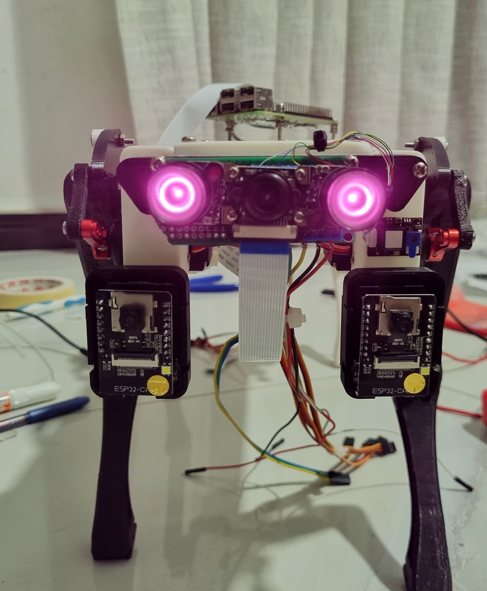
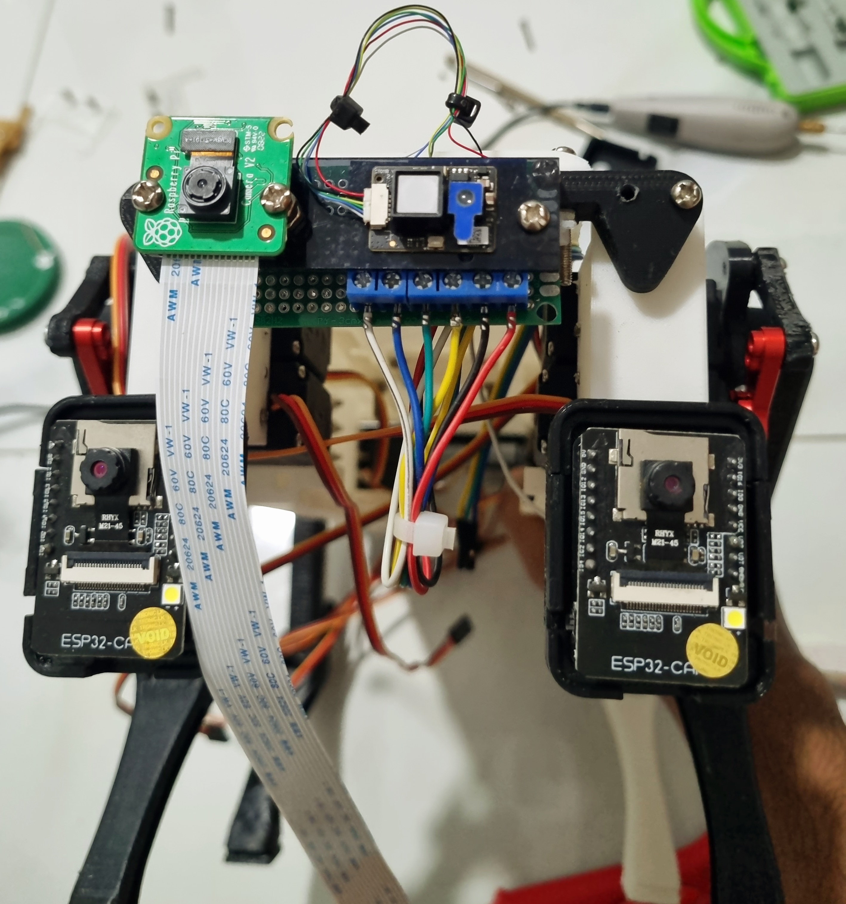
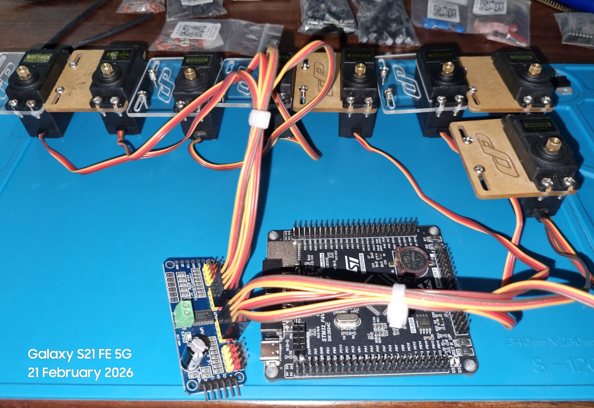
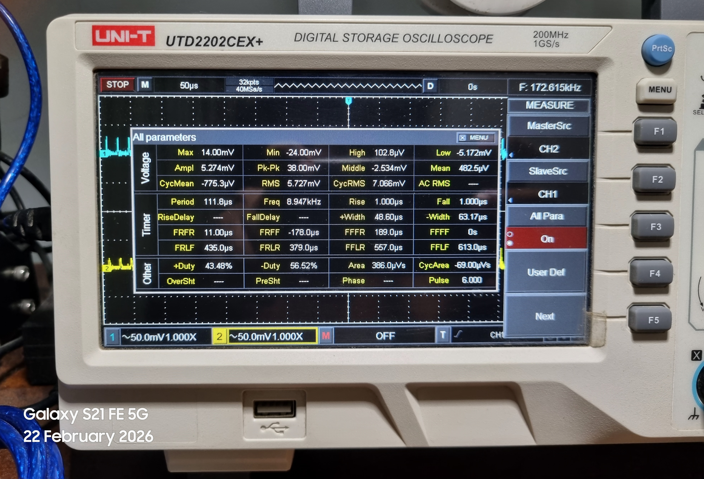
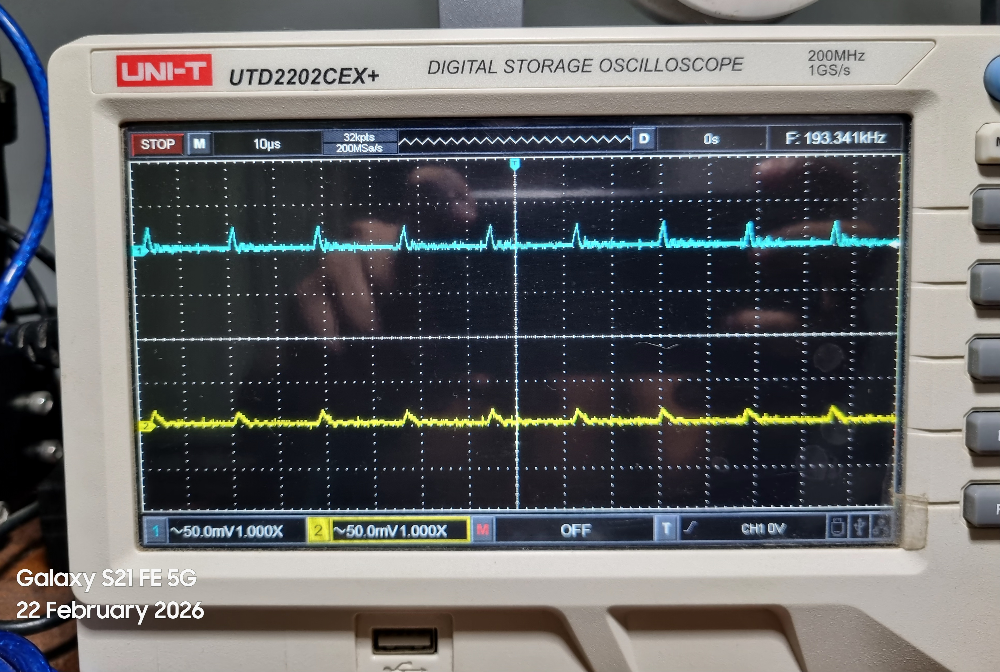

# HRNS-Q: Hybrid Robotic Nervous System for Quadrupeds


HRNS-Q is a quadruped robot prototype built around a hybrid robotic nervous system. The design separates fast reflex and safety logic from slower sensing, vision, dashboard and gait control, giving the robot a practical layered control architecture for final-year demonstration work.

<p align="center">
  
</p>

## What It Does

HRNS-Q demonstrates:

* Raspberry Pi 3 based high-level control
* PCA9685 based control of 8 hobby servos
* Four legs with active shoulder and knee joints
* Hip motors frozen in software because the current hardware does not use them
* STM32F407 low-level reflex and safety controller scaffold
* Sim and Real dashboard telemetry modes
* Two ESP32-CAM streams converted into a simple stereo heat view
* Wide-angle night-vision camera based human reaction logic
* MicroPython ESP32-CAM streaming path for non-Arduino workflows

## System Architecture

<p align="center">
  
</p>

The architecture is split into four practical layers.

| Layer | Hardware | Role |
|---|---|---|
| High-level controller | Raspberry Pi 3 | Dashboard, sensors, camera streams, gait commands, PCA9685 servo output |
| Actuation layer | PCA9685 and 8 servos | Shoulder and knee joint PWM control |
| Reflex layer | STM32F407 and reflex circuit | Foot contact, safety checks, future fast response path |
| Vision layer | Two ESP32-CAMs and night camera | Stereo heat view and human reaction trigger |

## Current Hardware

| Subsystem | Parts Used |
|---|---|
| Main computer | Raspberry Pi 3 |
| Low-level controller | STM32F407 |
| Servo driver | PCA9685 16-channel PWM board |
| Actuators | 8 x 180 degree hobby servos |
| Stereo vision | 2 x ESP32-CAM modules |
| Human reaction camera | Wide-angle night-vision camera without IR LEDs |
| Sensors | BMP280, BMI160, MLX90614, SGP30, Si7021, GPS and optional analog inputs |

<p align="center">
  
  
</p>

## Repository Layout

```text
Actuation System/          PCA9685 wiring and actuation notes
AI Neural System/          Legacy AI modules kept for reference
Communication/             CAN, I2C and UART maps
CPG System/                Gait tables and analog CPG design file
High Level Cognition/      Navigation and behavior planning modules
Localization Navigation/   GPS, navigation and estimation scripts
Low Level Control/         Python locomotion, STM32 firmware and assembly helpers
Perception/                Sensors, vision, stereo heat service and ESP32-CAM code
Power System/              Battery, fuse and power monitoring notes
Reflex System/             Reflex layer placeholders and interfaces
Safety/                    Safety checks, watchdog and shutdown command logic
Simulation Training/       Simulation environments and noise models
Software Framework/        Dashboard, telemetry and simulator
System Overview/           Architecture description
Vision/                    ESP camera and vision experiments
```

## Locomotion Model

The current prototype uses 8 servos only. Each leg has:

* Shoulder servo
* Knee servo
* Hip output held at 90 degrees in software

The locomotion code is classical and deterministic.

```python
hip_deg = 90.0
frame = build_locomotion_frame(t, gait, speed)
output.apply_frame(frame)
```

Main files:

```text
Low Level Control/python/hrnsq_locomotion.py
Low Level Control/python/pca9685_servo_driver.py
Low Level Control/python/verify_locomotion.py
```

## PCA9685 Servo Map

| PCA9685 Channel | Joint |
|---:|---|
| 0 | Front left shoulder |
| 1 | Front left knee |
| 2 | Front right shoulder |
| 3 | Front right knee |
| 4 | Rear left shoulder |
| 5 | Rear left knee |
| 6 | Rear right shoulder |
| 7 | Rear right knee |

## Dashboard

The dashboard supports two telemetry sources.

| Mode | Meaning |
|---|---|
| Sim | Generated values for demonstration and UI testing |
| Real | Raspberry Pi sensor values, PCA9685 actuator commands and camera streams |

Dashboard files:

```text
Software Framework/interface/websocket_server.py
Software Framework/interface/real_telemetry.py
Software Framework/interface/telemetry_state.py
Software Framework/interface/dashboard/
```

Run telemetry:

```bash
cd "Software Framework/interface"
python websocket_server.py
```

Run dashboard page:

```bash
cd "Software Framework/interface/dashboard"
python -m http.server 5500 --bind 0.0.0.0
```

Open:

```text
http://<raspberry-pi-ip>:5500/templates/dashboard.html
```

## Vision And Stereo Heat View

Two ESP32-CAM modules are mounted with:

| Parameter | Value |
|---|---:|
| Camera spacing | 15 cm |
| Camera height | 6 cm from ground |

This is not a calibrated depth system. The Raspberry Pi reads both ESP32 streams and creates a simple heat-style view for dashboard demonstration.

<p align="center">
  
</p>

Vision service:

```bash
cd "Perception/Depth Camera"
export HRNSQ_ESP32_LEFT_URL="http://192.168.1.51:81/stream"
export HRNSQ_ESP32_RIGHT_URL="http://192.168.1.52:81/stream"
export HRNSQ_NIGHT_CAM_INDEX="0"
python stereo_heat_server.py
```

Streams:

| Output | URL |
|---|---|
| Night camera | `http://<pi-ip>:9100/night.mjpg` |
| Stereo heat view | `http://<pi-ip>:9100/depth_heat.mjpg` |
| Human reaction JSON | `http://<pi-ip>:9100/reaction.json` |

## ESP32-CAM MicroPython

Arduino firmware is not required. The project includes a MicroPython stream server.

```text
Perception/Depth Camera/esp32_micropython/
```

Important requirement:

```python
import camera
```

The ESP32-CAM firmware must include the MicroPython `camera` module. Generic ESP32 MicroPython firmware often does not include it.

Upload with Thonny:

1. Flash ESP32-CAM camera-enabled MicroPython firmware
2. Save `config_left.py` as `config.py` on the left ESP32-CAM
3. Save `main.py` on the left ESP32-CAM
4. Save `config_right.py` as `config.py` on the right ESP32-CAM
5. Save `main.py` on the right ESP32-CAM

Expected stream URLs:

```text
http://192.168.1.51:81/stream
http://192.168.1.52:81/stream
```

## Human Reaction Logic

The night camera uses OpenCV based lightweight detection.

| Detection | Reaction |
|---|---|
| Face high in frame | `look_up` |
| Human centered and close | `give_hand` |
| Human visible | `look_at_human` |
| Nothing detected | `idle_scan` |

## Raspberry Pi Setup

Enable I2C and serial:

```bash
sudo raspi-config
```

Install packages:

```bash
sudo apt update
sudo apt install python3-full python3-venv i2c-tools git python3-opencv
python3 -m venv hrnsq_env
source hrnsq_env/bin/activate
pip install adafruit-blinka smbus2 numpy pynmea2
pip install adafruit-circuitpython-servokit
pip install adafruit-circuitpython-bmp280 adafruit-circuitpython-sgp30
pip install adafruit-circuitpython-si7021 adafruit-circuitpython-mlx90614
pip install adafruit-circuitpython-ads1x15 BMI160-i2c
```

Verify I2C:

```bash
i2cdetect -y 1
```

## STM32F407 Path

The STM32 side is used as the low-level reflex and safety controller scaffold.

```text
Low Level Control/stm32/
Low Level Control/stm32/firmware/asm/
```

Flash using STM32CubeIDE and ST-LINK.

The `firmware/asm` folder contains optional Cortex M4 assembly for the STM32F407
reflex path: IRQ lock and restore, low-power wait instructions, DWT cycle timing,
fast GPIO BSRR writes, EXTI reflex stubs and a startup/vector table template.
Use only one startup file in STM32CubeIDE. If CubeMX already generated startup
code, keep the CubeMX file and use the HRNS-Q startup file as a reference.

| ST-LINK | STM32F407 |
|---|---|
| SWDIO | PA13 |
| SWCLK | PA14 |
| GND | GND |
| 3.3 V sense | 3.3 V |
| NRST | NRST optional |

## Testing Evidence

<p align="center">
  
  
</p>

## Safety Notes

* Do not power servos from the Raspberry Pi.
* Use a separate 5 to 6 V high-current servo supply.
* Connect Raspberry Pi, PCA9685, STM32 and servo supply grounds together.
* Keep all Raspberry Pi GPIO and STM32 logic at 3.3 V.
* Test with the robot lifted before enabling movement.
* Real mode does not move servos unless `HRNSQ_ENABLE_SERVOS=1` is set.

## Quick Start

```bash
python "Low Level Control/python/verify_locomotion.py"
```

Start vision:

```bash
cd "Perception/Depth Camera"
python stereo_heat_server.py
```

Start telemetry:

```bash
cd "Software Framework/interface"
python websocket_server.py
```

Start dashboard:

```bash
cd "Software Framework/interface/dashboard"
python -m http.server 5500 --bind 0.0.0.0
```

## Status

HRNS-Q is a working prototype-level implementation. The simulator, dashboard, PCA9685 servo command path, ESP32-CAM heat view service and MicroPython camera streaming code are present. The STM32 reflex layer is prepared as a scaffold and should be completed through hardware testing.
